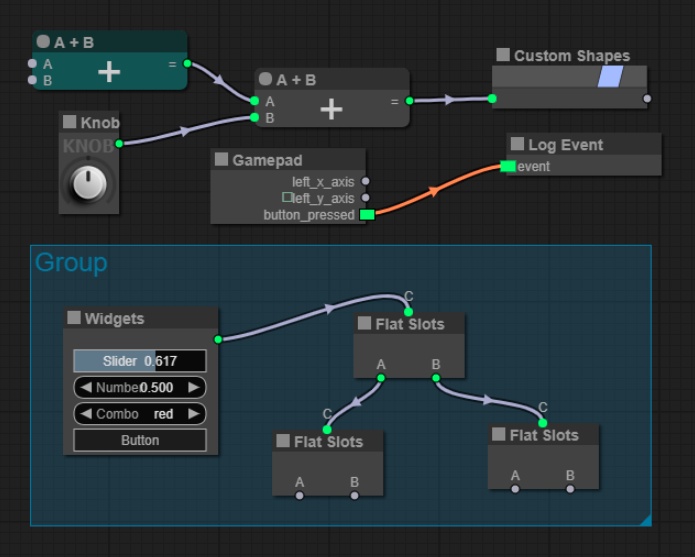
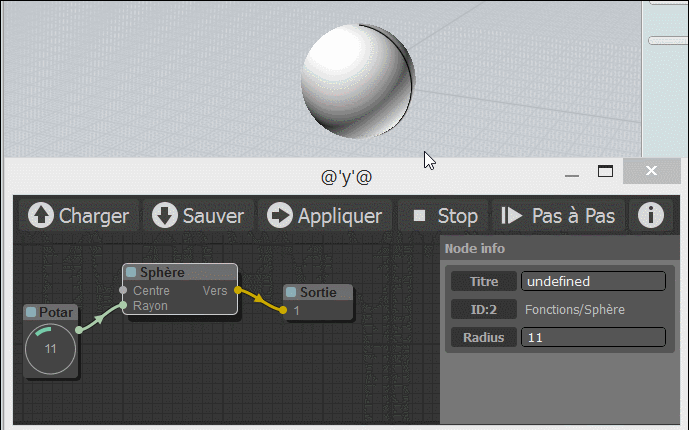
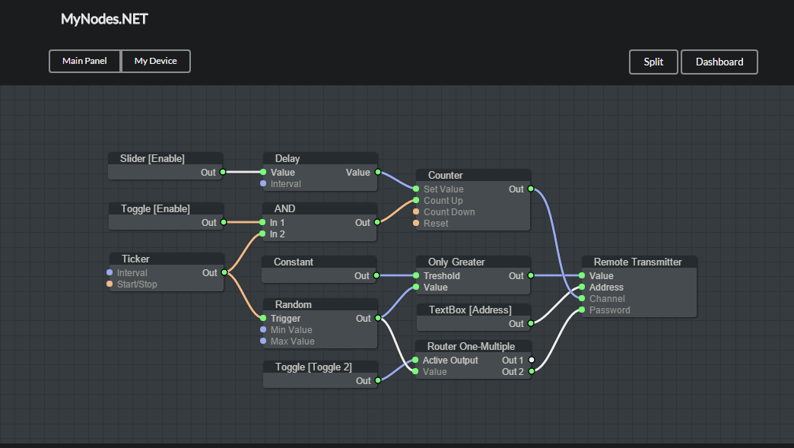

# litegraph.js

A library in Javascript to create graphs in the browser similar to Unreal Blueprints. Nodes can be programmed easily and it includes an editor to construct and tests the graphs.

It can be integrated easily in any existing web applications and graphs can be run without the need of the editor.

Try it in the [demo site](https://tamats.com/projects/litegraph/editor).



## Features
- Renders on Canvas2D (zoom in/out and panning, easy to render complex interfaces, can be used inside a WebGLTexture)
- Easy to use editor (searchbox, keyboard shortcuts, multiple selection, context menu, ...)
- Optimized to support hundreds of nodes per graph (on editor but also on execution)
- Customizable theme (colors, shapes, background)
- Callbacks to personalize every action/drawing/event of nodes
- Subgraphs (nodes that contain graphs themselves)
- Live mode system (hides the graph but calls nodes to render whatever they want, useful to create UIs)
- Graphs can be executed in NodeJS
- Highly customizable nodes (color, shape, slots vertical or horizontal, widgets, custom rendering)
- Easy to integrate in any JS application (one single file, no dependencies)
- Typescript support

## Nodes provided
Although it is easy to create new node types, LiteGraph comes with some default nodes that could be useful for many cases:
- Interface (Widgets)
- Math (trigonometry, math operations)
- Audio (AudioAPI and MIDI)
- 3D Graphics (Postprocessing in WebGL)
- Input (read Gamepad)

## Installation

You can install it using npm 
```
npm install litegraph.js
```

Or downloading the ```build/litegraph.js``` and ```css/litegraph.css``` version from this repository.

## First project ##

```html
<html>
<head>
	<link rel="stylesheet" type="text/css" href="litegraph.css">
	<script type="text/javascript" src="litegraph.js"></script>
</head>
<body style='width:100%; height:100%'>
<canvas id='mycanvas' width='1024' height='720' style='border: 1px solid'></canvas>
<script>
var graph = new LGraph();

var canvas = new LGraphCanvas("#mycanvas", graph);

var node_const = LiteGraph.createNode("basic/const");
node_const.pos = [200,200];
graph.add(node_const);
node_const.setValue(4.5);

var node_watch = LiteGraph.createNode("basic/watch");
node_watch.pos = [700,200];
graph.add(node_watch);

node_const.connect(0, node_watch, 0 );

graph.start()
</script>
</body>
</html>
```

## How to code a new Node type

Here is an example of how to build a node that sums two inputs:

```javascript
//node constructor class
function MyAddNode()
{
  this.addInput("A","number");
  this.addInput("B","number");
  this.addOutput("A+B","number");
  this.properties = { precision: 1 };
}

//name to show
MyAddNode.title = "Sum";

//function to call when the node is executed
MyAddNode.prototype.onExecute = function()
{
  var A = this.getInputData(0);
  if( A === undefined )
    A = 0;
  var B = this.getInputData(1);
  if( B === undefined )
    B = 0;
  this.setOutputData( 0, A + B );
}

//register in the system
LiteGraph.registerNodeType("basic/sum", MyAddNode );

```

or you can wrap an existing function:

```js
function sum(a,b)
{
   return a+b;
}

LiteGraph.wrapFunctionAsNode("math/sum",sum, ["Number","Number"],"Number");
```

## Server side

It also works server-side using NodeJS although some nodes do not work in server (audio, graphics, input, etc).

```js
var LiteGraph = require("./litegraph.js").LiteGraph;

var graph = new LiteGraph.LGraph();

var node_time = LiteGraph.createNode("basic/time");
graph.add(node_time);

var node_console = LiteGraph.createNode("basic/console");
node_console.mode = LiteGraph.ALWAYS;
graph.add(node_console);

node_time.connect( 0, node_console, 1 );

graph.start()
```


## Projects using it

### [comfyUI](https://github.com/comfyanonymous/ComfyUI)


### [webglstudio.org](http://webglstudio.org)


### [MOI Elephant](http://moiscript.weebly.com/elephant-systegraveme-nodal.html)



### Mynodes



## Utils
-----

It includes several commands in the utils folder to generate doc, check errors and build minifyed version.


## Demo
-----
The demo includes some examples of graphs. In order to try them you can visit [demo site](http://tamats.com/projects/litegraph/editor) or install it on your local computer, to do so you need `git`, `node` and `npm`. Given those dependencies are installed, run the following commands to try it out:
```sh
$ git clone https://github.com/jagenjo/litegraph.js.git
$ cd litegraph.js
$ npm install
$ node utils/server.js
Example app listening on port 80!
```
Open your browser and point it to http://localhost:8000/. You can select a demo from the dropdown at the top of the page.

## Feedback
--------

You can write any feedback to javi.agenjo@gmail.com

## Contributors

- atlasan
- kriffe
- rappestad
- InventivetalentDev
- NateScarlet
- coderofsalvation
- ilyabesk
- gausszhou


