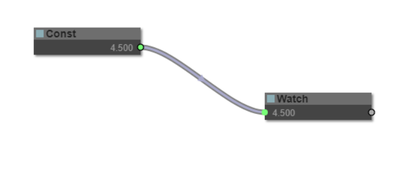

# litegraph.js

A library in Javascript to create graphs in the browser similar to [PureData](https://puredata.info/). Nodes can be programmed easily and it includes an editor to construct the graphs.

It can be integrated easily in any existing web applications and graphs can be run without the need of the editor.



## Installation

```
npm install litegraph.js
```

## First project ##

```html
<html>
<head>
	<script type="text/javascript" src="/litegraph.js"></script>
</head>
<body style='width:100%; height:100%'>
<canvas id='mycanvas' width='1024' height='720' style='border: 1px solid'></canvas>
<script>
var graph = new LGraph();

var canvas = new LGraphCanvas("#mycanvas", graph);

var node_const = LiteGraph.createNode("basic/const");
node_const.pos = [200,200];
graph.add(node_const);
node_const.setValue(4.5);

var node_watch = LiteGraph.createNode("basic/watch");
node_watch.pos = [700,200];
graph.add(node_watch);

node_const.connect(0, node_watch, 0 );

graph.start()
</script>
</body>
</html>
```

## How to code a new Node type

Here is an example of how to build a node that sums two inputs:

```javascript
//node constructor class
function MyAddNode()
{
  this.addInput("A","number");
  this.addInput("B","number");
  this.addOutput("A+B","number");
}

//name to show
MyAddNode.title = "Sum";

//function to call when the node is executed
MyAddNode.prototype.onExecute = function()
{
  var A = this.getInputData(0);
  if( A === undefined )
    A = 0;
  var B = this.getInputData(1);
  if( B === undefined )
    B = 0;
  this.setOutputData( 0, A + B );
}

//register in the system
LiteGraph.registerNodeType("basic/sum", MyAddNode );

```


## Projects using it

### [webglstudio.org](http://webglstudio.org)


### [MOI Elephant](http://moiscript.weebly.com/elephant-systegraveme-nodal.html)


### [Mynodes.NET](http://www.mynodes.net)


## Utils
-----

It includes several commands in the utils folder to generate doc, check errors and build minifyed version.


## Feedback
--------

You can write any feedback to javi.agenjo@gmail.com
